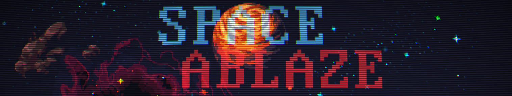
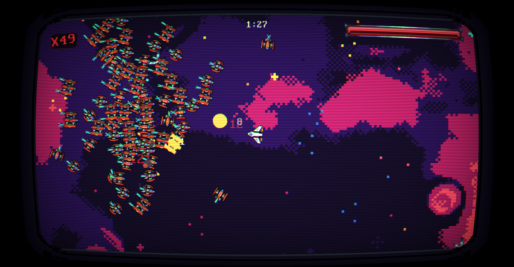
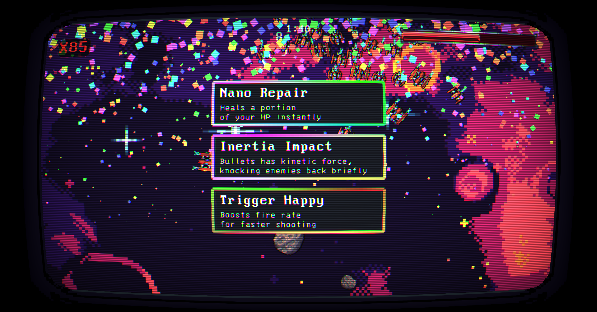
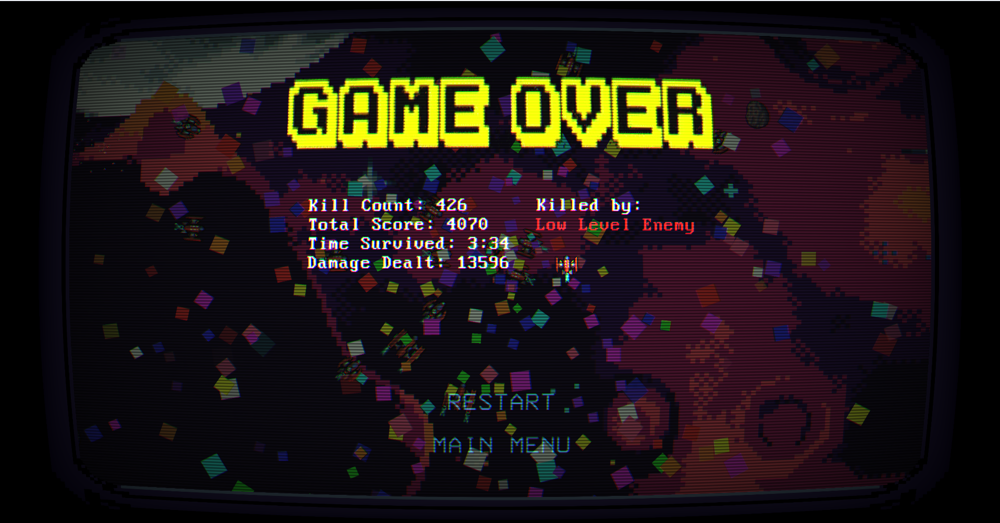

<div align="center">


[](https://opensource.org/licenses/MIT)
[](https://isocpp.org/)
[](https://www.raylib.com/)
[](https://github.com/dandee77/Space-Ablaze)

</div>

## 🌟 About

**Space Ablaze** is an intense, fast-paced 2D space shooter that throws you into the heart of galactic warfare! Navigate through asteroid fields, battle diverse enemy fleets, and upgrade your ship's capabilities as you fight for survival in the vast cosmos.

## 🚀 Gameplay Features

### 🛸 **Combat System**

- **Multi-directional shooting** with mouse aiming
- **Powerups variety**: Scatter shot, piercing rounds, etc..
- **Scaling difficulty** for tactical gameplay

### 👾 **Enemy Variety**

- **Low-Level Enemies**: Fast, agile threats that swarm the player
- **Mid-Level Enemies**: Ranged attackers with strategic behavior
- **Asteroid Fields**: Environmental hazards that block movement

### ⚡ **Augment System**

Choose from **9 powerful upgrades** every 20 seconds:

| Augment                | Effect                        |
| ---------------------- | ----------------------------- |
| 🔫 **Rapid Fire**      | Increases attack speed        |
| 💥 **Trigger Happy**   | Adds burst fire mode          |
| 🎯 **Scatter Shot**    | Multi-directional projectiles |
| ⚡ **Speed Demon**     | Enhanced movement speed       |
| 🛡️ **Nano Repair**     | Increased health pool         |
| 🔥 **Piercing Rounds** | Bullets penetrate enemies     |
| 👻 **Phase Shift**     | Extended invincibility frames |
| 🔄 **Gyro Control**    | Faster ship rotation          |
| 💢 **Inertia Impact**  | Adds knockback to bullets     |

## 🎮 Controls

### 🕹️ Movement

- W / A / S / D – Smooth 360° movement
- hip Rotation – Full analog-style control

### 🖱️ Combat

- Mouse Aim & Shoot – Aim with the mouse

- Left Click – Fire weapon

- Auto-Aim Mode – Optional toggle for assisted targeting

### ⌨️ Interface

- P – Toggle Pause

- E – Toggle Auto-Fire

## 🖼️ Screenshots





## 🛠️ Installation & Setup

### 📋 **System Requirements**

```
💻 MINIMUM SPECS          🚀 RECOMMENDED SPECS
   • OS: Windows 10+         • OS: Windows 11+
   • RAM: 4GB                • RAM: 8GB+
   • CPU: Dual-core 2.0GHz   • CPU: Quad-core 3.0GHz+
   • GPU: DirectX 11         • GPU: Dedicated graphics
   • Storage: 100MB          • Storage: 1GB SSD
```

### **Required Dependencies**

Before building **Space Ablaze**, ensure you have:

- 🔧 **CMake** (Minimum version 3.10)
- 💻 **C++ Compiler**:
  - **MinGW-w64** (Windows with GCC)
  - **Microsoft Visual Studio (MSVC)** (Windows with Visual Studio)
  - **GCC** (Linux/macOS)
- 🔨 **Make** (Required for Linux and MinGW users)

### **🔧 Installation Steps**

#### **1. Install CMake**

```bash
# Windows
# Download from: https://cmake.org/download/

# Linux (Ubuntu/Debian)
sudo apt update && sudo apt install cmake

# macOS (Homebrew)
brew install cmake
```

#### **2. Install C++ Compiler**

<details>
<summary>🪟 <strong>Windows (MinGW-w64)</strong></summary>

```bash
# Install MinGW-w64 and add bin folder to PATH
# Download from: https://www.mingw-w64.org/

# Verify installation
g++ --version
```

</details>

<details>
<summary>🪟 <strong>Windows (Visual Studio MSVC)</strong></summary>

```bash
# Install Visual Studio with "Desktop Development with C++" workload
# Download from: https://visualstudio.microsoft.com/

# Use Visual Studio Developer Command Prompt
```

</details>

<details>
<summary>🐧 <strong>Linux (GCC)</strong></summary>

```bash
# Ubuntu/Debian
sudo apt install build-essential g++

# Fedora/RHEL
sudo dnf install gcc-c++ make

# Arch Linux
sudo pacman -S base-devel
```

</details>

### **🚀 Build and Run**

#### **Quick Start (All Platforms)**

```bash
# Clone the repository
git clone https://github.com/dandee77/Space-Ablaze.git
cd Space-Ablaze

# Build and run
mkdir build && cd build
cmake ..
cmake --build .

# Run the game
./SpaceAblaze          # Linux/macOS
SpaceAblaze.exe        # Windows
```

<details>
<summary>🔧 <strong>Platform-Specific Build Instructions</strong></summary>

#### **MinGW (Windows)**

```bash
mkdir build && cd build
cmake -G "MinGW Makefiles" ..
cmake --build .
./SpaceAblaze.exe
```

#### **Visual Studio (Windows)**

```bash
mkdir build && cd build
cmake -G "Visual Studio 17 2022" ..
cmake --build .
# Or open the .sln file in Visual Studio
```

#### **GCC (Linux/macOS)**

```bash
mkdir build && cd build
cmake ..
make -j$(nproc)  # Use all CPU cores
./SpaceAblaze
```

</details>

## 🤝 Contributing

We welcome contributions to **Space Ablaze**! Here's how you can help:

### 🐛 **Bug Reports**

Found a bug? Please [open an issue](https://github.com/dandee77/Space-Ablaze/issues) with:

- Detailed description of the problem
- Steps to reproduce
- System information
- Screenshots/videos if applicable

### ✨ **Feature Requests**

Have an idea for a new feature? We'd love to hear it!

- Check existing [issues](https://github.com/dandee77/Space-Ablaze/issues) first
- Describe your idea clearly
- Explain how it would improve the game

### 🔧 **Code Contributions**

1. Fork the repository
2. Create a feature branch: `git checkout -b feature/amazing-feature`
3. Commit your changes: `git commit -m 'Add amazing feature'`
4. Push to the branch: `git push origin feature/amazing-feature`
5. Open a Pull Request

## 📜 License

This project is licensed under the **MIT License** - see the [LICENSE](LICENSE) file for details.

```
MIT License - Space Ablaze

Permission is hereby granted, free of charge, to any person obtaining a copy
of this software and associated documentation files (the "Software"), to deal
in the Software without restriction, including without limitation the rights
to use, copy, modify, merge, publish, distribute, sublicense, and/or sell
copies of the Software, and to permit persons to whom the Software is
furnished to do so, subject to the following conditions:

The above copyright notice and this permission notice shall be included in all
copies or substantial portions of the Software.
```

## 📞 Connect & Support

<div align="center">

### 🌌 **Join the Space Ablaze Community!** 🌌

[](https://github.com/dandee77/Space-Ablaze)
[](https://github.com/dandee77/Space-Ablaze/issues)
[](https://github.com/dandee77/Space-Ablaze/discussions)

Ready to embark on your space adventure? <br>
Download Space Ablaze and start blasting!

**Made with ❤️ and lots of ☕ by the Space Ablaze Team**

</div>
